# Teach Yo'Self

Chris, Elise, Henry

---

### Links to deployed websites

Front-End: <br>
https://teachyoself-web.herokuapp.com/

Back-End <br>
https://teachyoself-api.herokuapp.com/


---

### Links to GitHub Repository

Main GitHub <br>
https://github.com/Team-Elise-Henry-Chris

Front-End: <br>
https://github.com/Team-Elise-Henry-Chris/T3A2_frontend

Back-End <br>
https://github.com/Team-Elise-Henry-Chris/T3A2_backend


---

### Purpose

The primary purpose of Teachyoself is to enable users to locate and access high quality educational resources. 

While the internet has enabled unparalleled access to information, it can still be difficult to find suitable learning resources. Firstly, there are many platforms for educational content, and having to swap between and search on these platforms can be discouraging. Teachyoself overcomes this friction by collating resources in one central place. Furthermore, it can be difficult to assess the quality of a learning resource. Investing time to learn something only to find the resource lacks quality is frustrating and presents a barrier to entry to learning. Teachyoself overcomes this boundary with its community driven submission and rating system. Users submit educational resources to a topic in the form of a post submission, and other users in the community are then able to rate the resource. This process allows for the democratic selection of quality resources. Additional features such as posts filtering allow only the most relevant resources to be shown to the user.

Secondarily, Teachyoself provides a community environment for the sharing and discussion of topics. The separation of topics into their own pages is a self-selecting process that connects users together through a common interest, and allows them to share their passion. Once the core functionality of the app has been completed, additional community features such as commenting, user profiles and messaging will increase the degree of interaction possible between users, and improve the engagement and quality of the community.

While there are a lot of educational platforms, most do not share content from external sites. Sites that compile resources from multiple sources are often subject specific and curated by a select few individuals, while community discussion sites like reddit are typically not focused on education. Teachyoself aims to fill a void for cross-platform, community driven education resource collation.

---

### Functionality/Features

- Navbar
    - Home page - contains all the topics
    - Create posts - allows logged in users to create a new post
- User Authentication
    - Sign up page
    - Log in page (user will be directed here if trying to create a new post)
- Logged in users can rate a post using a star system 
- Logged in users can create, update and delete their own posts 
- All users can filter topics 
- Non logged in users are restricted to only viewing posts and topics  
- Admin can create/update topics/categories
- Admins can edit and remove any posts

---

### Target Audience

Anyone wishing to learn, teach or contribute to a topic that they are passionate about, in an online community of users.

For example, a professional photographer might post something about ‘How to set up the camera and compose a stunning photo’. This professional might write out the steps in text form, or create a podcast, video, article or any other type of resource and include a link to the resource in the post. Another hobbyist photographer user may also want to create a post to a link to a useful resource they found such as ‘How to correctly select lens filters’. This generation of content ranging from resource creators to consumers, and from hobbyist to professional creates a diverse range of resources that appeals to a wide audience. The target audience also doesn’t necessarily have to upload a post either - they can simply learn from other people's posts without sharing their own content, and provide ratings on posts when they desire. A quality and insightful post will get voted highly by many people - which eventually leads to the post becoming a foundational piece of knowledge for anyone interested in the topic. The quality rating ensures a high quality of resource, and filters out low quality posts that may discourage selective users.


---

### Tech Stack

- React
- Express
- Node.js 
- MongoDB
- Tailwind

---

### Dataflow Diagram (DFD)

#### Login/Sign up DFD
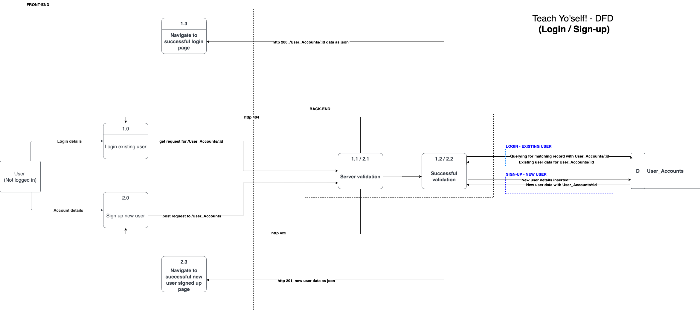

#### New Post DFD


#### View Post DFD


#### Edit Post DFD


#### Delete Post DFD


#### View Topic DFD


#### New Star Rating DFD


#### Edit Star Rating


---

### Application Architecture Diagram (AAD)


---

### User Stories

- As a user, I want to be able to see a list of posts on a topic page, so that I can access resources to learn about the topic.
- As a user, I want to be able to log in/sign up, so that I can have full access to the website.
- As a user, I want to be able to access my account page, so that I can view and edit my details.
- As a user, I want to be able to submit a post, so that I can share a good resource I found.
- As a user, I want to be able to edit my post, so I can update it with more information and fix my mistakes.
- As a user, I want to be able to delete my post, in case I decide it isn't relevant.
- As a user, I want to see categories of topics on the main landing page, so that I can quickly navigate to my desired topic.
- As a user, I want to be able to sort and filter posts, so I can find the posts that are most relevant to me.
- As a user, I want to be able to rate a post out of five, so that I can let other users know how good the content is.
- As a user, I want to see a navigation menu, so that I can go to other pages of the website with ease.
- As a user, I want to be able to view the website easily on a mobile device, so I can interact with it on the go.
- As an admin, I want to be able to delete and edit posts, so I can remove malicious content.

---

### Wireframes

#### Original Design:

Our original wireframes were created in Balsamiq and used as a visual aid to improve and iterate upon. These wireframes were intentionally left to a low fidelity to make starting the wireframing process easy, and to allow us to visualise the site layout and discuss specific aspects to improve on.

Original Login Page Design  


Original Home Page Design  
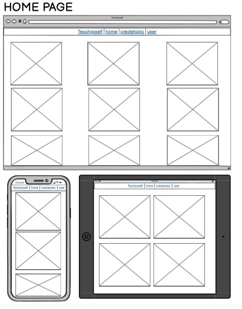

Original Create Post Design  
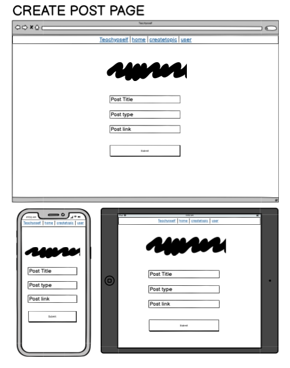

Original Topic Page Design  
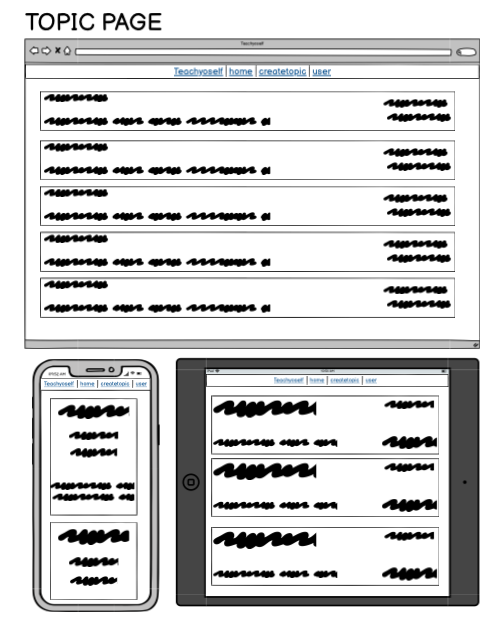

#### Reviewed/Final Design 

The following wireframes were created in figma with improvements and additional detail over the original designs. Attention was paid to the layout of tiles on the home page and topic page to prioritise the presentation of content and make the pages feel less cramped. The navbar design was changed to be more sleek, and made easier to navigate by following the modern convention of having the site name followed by navigation links on the left, and user profile related links on the right. The post tile arrangement was also elucidated in further detail while maintaining comfortable spacing on all screen sizes and a thumbnail icon for easy visual reference. The button layout on the login page was also adjusted to avoid any confusion of the login button for the register button.

Additional commentary on design choices, functions and actions has been described on the green 'post it' notes and red arrows, while relationships between screens have been shown through the black arrows.

**Login Page**
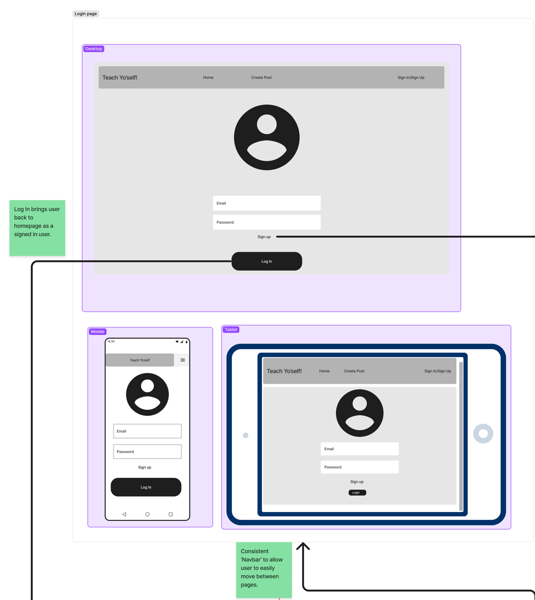

**Home Page**  
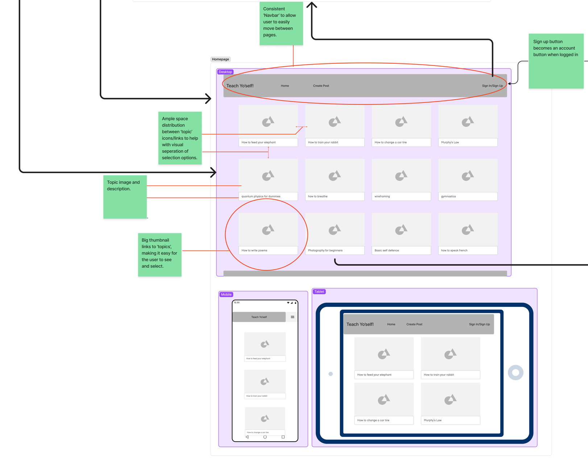

**Topic Page**  


**Create Post**  


**Create an Account**  
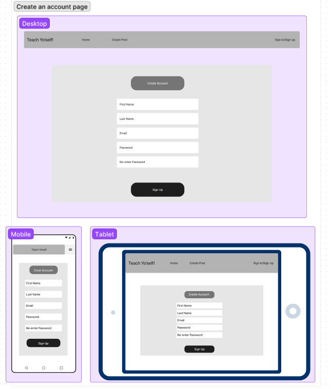

**Wireframe Overview/Project Flow**  


---
### Trello and Planning 

**29/06/2022**
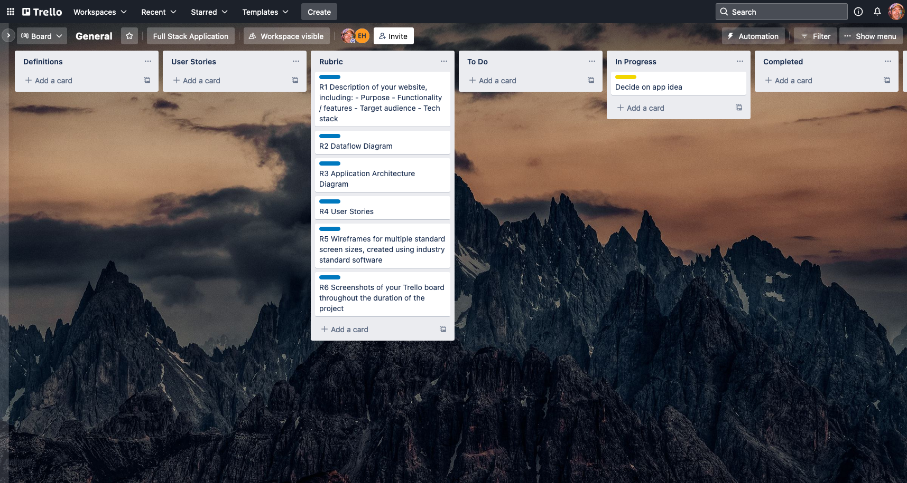

**30/06/2022 - 1**


**30/06/2022 - 2**


**30/06/2022 - 3**


**01/07/2022**
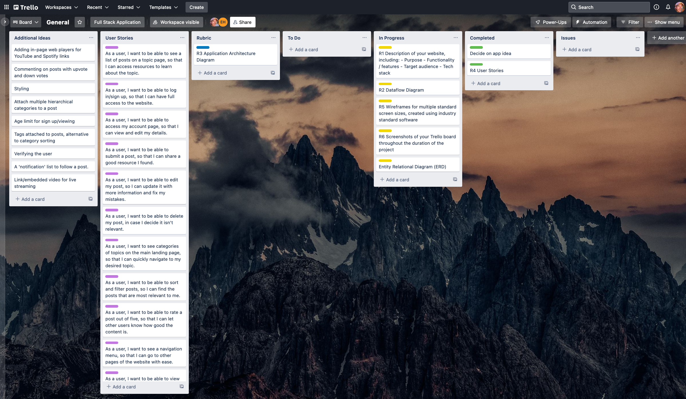

**04/07/2022**


**07/07/2022**


**11/07/2022**


**11/07/2022**


**11/07/2022**
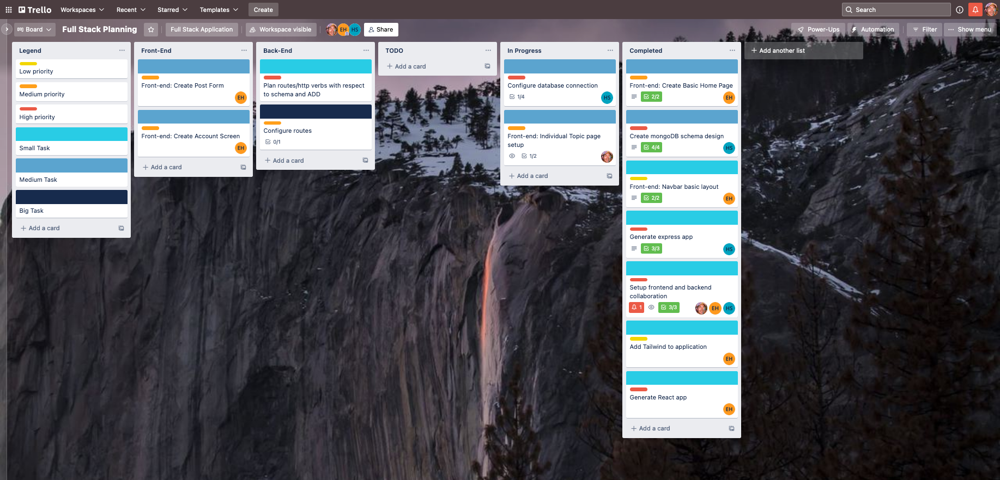

**12/07/2022**
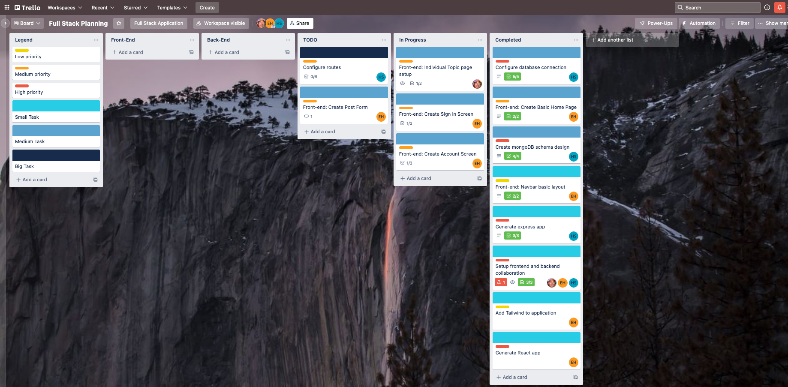

**13/07/2022**
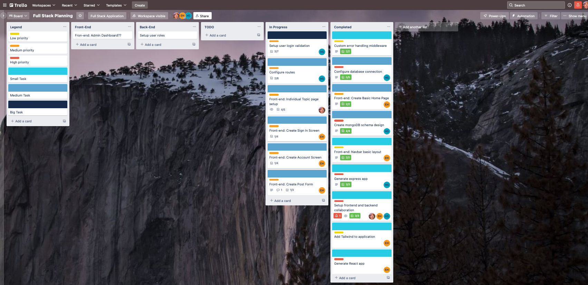

**19/07/2022**
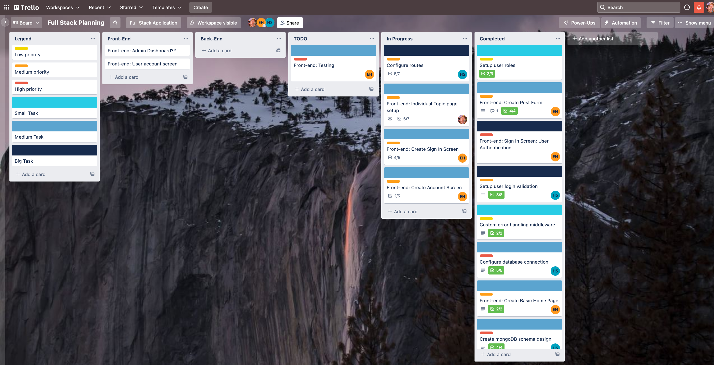

**22/07/2022**
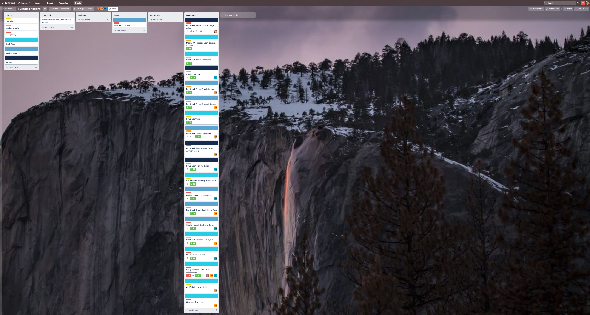

---
#### Team Logbook 


**29 June**

- Found out who we are working with
- Connected on discord and 
- Brainstorming ideas
- Working out technologies and services to use
- Setting up Trello board
- Setup google doc to plan
- Laying out GitHub structure

**30 June**

- Set up github organisation for the team
- Decided on idea
- Researched different authentication solutions (userfront, auth0)
- Discussed order and scope of requirements
    - R1 first
      - Outline MVP and then write any additional features separately
    - Write up user stories
    - Dataflow and application diagram
    - Update user story subtasks as per diagrams
    - Wireframes
- Wrote up idea pitch
- Community Driven education resources app idea approved by Glen
  - Feedback: Admin to make topics and user chooses pre-existing topic to post to
- Trello screenshot updated
- Preliminary ‘Purpose’ and ‘Target Audience’ for review by team

**1 July**

- Started planning out the day and delegation of tasks
- Completed user stories
- Revisited MVP, outlined application features
- Decided to use lucidchart for diagramming
- Decided to use figma for wireframing
- Started wireframing collaboration in figma (desktop, tablet, mobile)
  - Homepage
  - Login
  - Account
  - Topic

**4 July**

- Working on DataFlow Diagram and meeting its expectations
  - Got feedback from Glen with an example of a good DFD
- Considering changing MongoDB to Postgres and mongoose with node-postgres to align with our more relational database project
- App ‘purpose’ has been re-written
- App ‘target audience’ has been re-written
- ERD has been updated

**5 July**

- DFD updated following Glen’s example.
  - Separated each feature:
      - Login
      - new star rating
      - edit star rating
      - edit post
      - delete post 
      - view post 
      - view topic 
      - new post
- Grouping Front-end and Back-end processes.
- Updated Wireframes, with page linking logic and more details of buttons and text layout

**6 July**

- Updated AAD - added testing
- DFD is now final and looks good to Glen.
- Started compiling the documentation together in a single README.md file
- Revisited wireframes

**7 July**

- Updated wireframes with more detailed description of thought processes and why the final layout has been chosen
- Continuing to compile README.md file with updated content
- Finished README.md file
- Started planning for Part B
- Front-end framework will be React Vite.
- https://www.linkedin.com/pulse/setting-up-rtl-vite-react-project-william-ku
- https://docs.netlify.com/configure-builds/manage-dependencies/
- To troubleshoot Vite version error:
```npm i -D @testing-library/jest-dom @testing-library/react @testing-library/react-hooks @testing-library/user-event jsdom vitest –legacy-peer-deps```
- T3A2-A Full Stack App (Part A) - complete, unless further instructions from Matt or Glen.
- README.md and docs in compressed format.
- Created ‘Timeline’ spreadsheet as a journal to track actual project progress.
- Setup new google drive folder and document for part B

**8 July**

- Planned out the tasks for the day
  - Elise to start front end home page, configure tailwind
    - Created Components and Pages folders
    - Added Home, TopicList and Topic components
    - Added routes - only homepage route currently working
    - Hardcoded topics
    - Installed react-router-dom
    - Installed Tailwind and DaisyUi
    - Added basic homepage layout with card styles
    - Added basic navbar
    - Fixed formatting issues
  - Henry to create database schemas, create express repo/app
- Updated trello with new tasks
- For rubric requirement - trello include/show commit history 
  - Decided to link to a pull request corresponding to the finished item
- Setup express app template file structure

**11 Jul** 

- Planned out the tasks for the day.
  - Elise working on front-end Post form page.
  - Henry working on connecting back-end to Atlas.
  - Chris working on front-end individual Topic page.
    - Created individual topics page
    - Added routes for individual topics page
    - Made sample Topic Posts to use for formatting purposes
    - Updated existing Topics List page so that 'View Posts' links direct to that Topic
- Updated trello board tasks.
- Updated trello board screenshots.


**12 Jul** 
- Continuing planned tasks from yesterday.
  - Elise working on front-end Post form page.
    - Decided to work on the sign in and create account page first
      - Users need to be signed in to create a post, saves me refactoring the create post code later to accommodate with this
    - Sign in page was create with basic styling
    - Basic create account page was created
    - Backend calls need to be made so a user can be created/sign in
  - Henry working on connecting back-end to Atlas.
    - Mongoose and environment variables set up.
    - Topic routes complete.
  - Chris working on front-end individual Topic page.
    - Mobile layout almost complete, missing edit button.


**13 Jul**
- Planned out the tasks for the day.
  - Elise working on front-end New Post form.
  - Henry working on back-end authentication.
  - Chris working on front-end individual Topic page.
- Updated trello board tasks.
- Updated trello board screenshots

**14 Jul**
- Had a team chat and planned out the tasks for the day
  - Elise working on front-end routing and New Topic page tweaks.
  - Henry working on back-end authentication.
  - Chris working on front-end individual Topic page.
- Updated trello board tasks.
- Updated trello board screenshots

**15 Jul** 
- Elise working on login authentication logic on frontend
  - Getting the frontend ready for api calls
  - Installed axios
  - Started authentication for user sign up/sign in
- Henry working on back-end routing and schema.
- Chris working on front-end star rating and sorting function.
  - Star rating logic complete.
- Updated trello board tasks.
- Updated trello board screenshots

**18 Jul** 
- Elise working on login authentication logic on frontend
- Henry working on back-end routing.
- Chris working on front-end connecting posts index page.
- Updated trello board tasks.
- Updated trello board screenshots

**19 Jul** 
- Team meeting:
  - Cors issues during deployment.
  - Elise - front-end create account error handling.
  - Henry - routes back-end
  - Chris - front-end:
    - connecting index page to backend complete.
    - Individual topic pages only displaying filtered posts about topics(locally working).
    - Only user that created Posts can delete/edit them (locally working).
  - Testing and error handling left in in App to address.
  - User Testing spreadsheet still outstanding.

**20 Jul** 
- Elise working on front-end Admin page, error handling, testing.
- Henry working on back-end routing, testing.
- Chris working on front-end linking back-end Posts data to front-end, star rating feature. 

**21 Jul** 
- Elise working on front-end Admin page, error handling, testing.
- Henry working on back-end refactoring, testing.
- Chris working on front-end star rating feature, edit/delete posts connect to back-end and filter users with userid. 

**22 Jul**
- Elise fixing errors with frontend 
- Chris started testing on frontend
- Henry continuing with backend testing
- README updated 
- Submitted Project on Canvas!

---
### Project Actual Timeline


---

### User Testing
(INCOMPLETE)

---

### Libraries Used
**Front-End:**
- "axios": "^0.27.2",
  - This was used to call on routes from the back-end database, as an alternative to fetch requests.
- "daisyui": "^2.18.0",
  - A design interface for the app in conjunction with Tailwind to help with quick design layouts and visual formatting.
- "jwt-decode": "^3.1.2",
  - A decoder to help with decoding access tokens to enable encrypted sending and receiving of things such as user_id, user_role for security purposes.
- "moment": "^2.29.4",
  - A date formatter to help with producing the desired date format from the system's default one.
- "react": "^18.0.0",
  - The main front-end framework used for this project in combination with javascript.
- "react-dom": "^18.0.0",
  - The interface used between React and DOM, with primary function of mounting the app to the index.
- "vite": "^2.9.9",
  - Another framework used in combination with React for the front-end and also provides access to Vitest which handles unit and integration testing.
- "react-icons": "^4.4.0",
  - Used to access star icons for star rating feature of the app.
- "react-router-dom": "^6.3.0"
  - Used for setting up dynamic routing in the front-end.


---